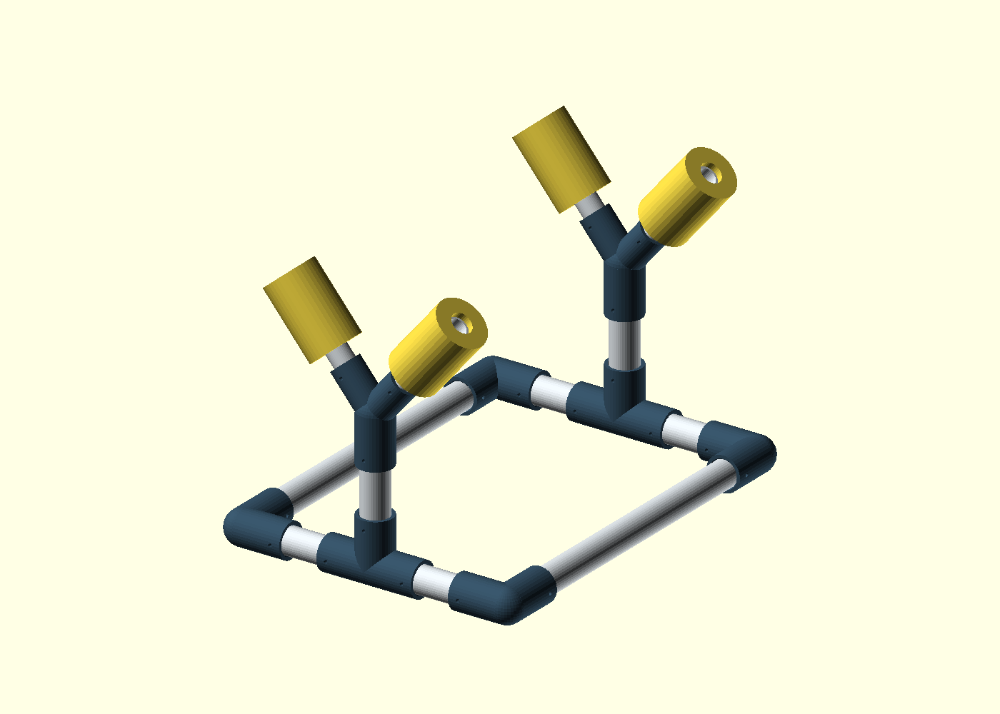

# Desktop RC airplane stand — first prototype

A PVC desktop stand with printed connectors and four pool-noodle pads, intended for approximately 1.2 m RC airplanes including the user's Timber X. The airplane can be lifted out and placed upright or inverted. This is a dimensioned starting design, not a verified Timber X fit or load-rated stand. No airplane geometry has been assumed accurate enough to model.



White = PVC; blue = printed connectors; yellow = pool noodles. The airplane's nose-tail axis follows the long rails. Two transverse V-cradles support the fuselage at separate stations. The open middle leaves room for landing-gear work. Choose contact positions that avoid the gear mount, canopy, control surfaces and unsupported foam in **both** orientations. The two V heads are identical initially; their angle can be changed between individual exports if the front and rear need different shapes.

## Starting layout

All dimensions are mm. These are proposed dimensions, not measurements of the airplane.

| Dimension | Default |
|---|---:|
| Base center-to-center, nose-tail × across | 460 × 340 |
| Approximate outside footprint, excluding bolt heads | 504 × 384 (19.8 × 15.1 in) |
| Front/rear cradle station spacing | 460 |
| Tee center to cradle center | 180 |
| Cradle hub center above desk, excluding feet | 202 |
| Approximate top of padding above desk | 356 (14 in) |
| Included V angle | 80° |
| Socket insertion depth | 35 |
| Foam outside diameter used in preview | 65 |

Actual fuselage resting height depends on its width and foam compression. Check upright prop/gear clearance and inverted canopy/fin clearance before cutting all pipes. For a lower stand, reduce `post_centers`; it must remain greater than 122 mm with these connectors. The design adjusts by replacing pipe lengths or changing CAD parameters; it is not telescoping or tool-free adjustable.

## Files

- `desktop-rc-plane-stand.scad`: complete assembly plus printable corner, tee, cradle and fit rings; select `part` at the top or through the Customizer.
- `fit-samples.scad`: both nominal pipe fit rings on one plate.
- `layout.png`: assembly preview generated from the CAD.
- `exports/`: generated STL files, ignored by git.

## Materials and cut list

**Check contact positions with the airplane before cutting.** Pipe cuts include the inserted ends. With the default 26 mm center-to-stop offset:

| Material / part | Quantity | Length / notes |
|---|---:|---|
| 1″ PVC long rail | 2 | 408 mm each |
| 1″ PVC half crossbar | 4 | 118 mm each |
| 1″ PVC upright | 2 | 128 mm each |
| 3/4″ PVC cradle arm | 4 | 140 mm each |
| Pool noodle | 4 | 95 mm each; extend 8 mm past pipe tips |
| Printed corner | 4 | Same part, rotate for each corner |
| Printed tee | 2 | Two horizontal sockets and one upright |
| Printed cradle | 2 | One downward 1″ socket, two angled 3/4″ sockets |
| M4 × 55 bolts | 16 | Starting length for 1″ sockets; check actual hardware |
| M4 × 45 bolts | 4 | Starting length for arm sockets |
| M4 locknuts / washers | 20 / 40 | Do not crush the PVC or printed wall |
| Adhesive rubber feet | As needed | Under base connectors; thick enough to clear downward bolt hardware |

Total PVC before saw kerf: 1,544 mm of 1″ and 560 mm of 3/4″. Buy/cut extra only as needed for your stock and fit trials.

Cut formulas if resizing: long rail = `base_length - 2*stop_offset`; each half crossbar = `base_width/2 - 2*stop_offset`; upright = `post_centers - 2*stop_offset`. Increasing socket depth without changing the stop offset does not change the pipe cuts, but requires more space between connectors.

## Pipe fit

Defaults assume US IPS PVC: 1″ nominal has 33.40 mm outside diameter and 3/4″ nominal has 26.67 mm outside diameter. Source: [Charlotte Pipe Schedule 40 dimensional table](https://www.charlottepipe.com/uploads/documents/technical/BR-PK.pdf). Measure your stock; other tubing standards may differ.

Sockets add **0.50 mm diametral clearance** (0.25 mm per side). Print the rings first and adjust `diametral_clearance` in the main file for a hand-sliding fit. If changing pipe sizes, also change the two nominal diameter arguments in `fit-samples.scad`. Rings test diameter only; print one full connector next to verify the deeper socket and support removal. Printed bore dimensions vary by printer and material.

Noodle holes are not standardized. Measure yours; slit lengthwise if needed and retain with a soft wrap that cannot touch the airplane. The preview assumes a hole matching the arm diameter. Keep hard pipe ends recessed and cover exposed hard connectors if the fuselage could reach them.

## Printing and assembly

Starting settings: PETG, 0.20 mm layers, 6 perimeters, 40–50% gyroid infill, 6 top/bottom layers. These are prototype settings, not strength validation.

The part selector places each connector on its side, with all socket axes parallel to the bed. Use a brim and supports, including inside the horizontal bores; the rounded exterior has a narrow initial bed contact. Inspect slicer layers and ensure bore supports can be removed through the socket mouths. Fit rings print flat without supports. Do not print the `assembly` selection as a single object.

1. Print fit rings, then one connector. Deburr the pipe and verify it reaches the blind stop without hammering.
2. Dry-fit the base, posts and cradles. Test the unloaded layout against the actual airplane in both orientations, with someone supporting the airplane.
3. Mark joint alignment. Use the 4.5 mm transverse holes to mark/drill the PVC, then fit the M4 bolts, washers and locknuts. Every occupied socket needs retention; friction alone does not prevent rotation. Drill one side at a time if access is awkward.
4. Install rubber feet so bolts cannot touch the desk. Fit the noodle sleeves and confirm they cannot slide off during handling.
5. Test progressively with a substitute load before placing the airplane on it. Check joint movement, flex and tipping. No maximum supported weight is established yet.

For inverted gear work, remove the battery and propeller. Lift the airplane clear to turn it over; the stand has no rotating fixture. Position the center of gravity inside the base footprint. This is a static maintenance/display stand, not an engine or motor run-up stand.

## Export

With `openscad` on PATH, run from the repository root:

```sh
openscad -o projects/desktop-rc-plane-stand/exports/corner.stl -D 'part="corner"' projects/desktop-rc-plane-stand/desktop-rc-plane-stand.scad
openscad -o projects/desktop-rc-plane-stand/exports/tee.stl -D 'part="tee"' projects/desktop-rc-plane-stand/desktop-rc-plane-stand.scad
openscad -o projects/desktop-rc-plane-stand/exports/cradle.stl -D 'part="cradle"' projects/desktop-rc-plane-stand/desktop-rc-plane-stand.scad
openscad -o projects/desktop-rc-plane-stand/exports/fit-samples.stl projects/desktop-rc-plane-stand/fit-samples.scad
```

## Verification

The three connector exports were rendered with OpenSCAD 2021.01; all report `Simple: yes`, with one solid plus the exterior volume. The assembly preview was visually inspected. These checks establish CAD exportability, not physical fit, print strength, airplane clearance or stability. Physical verification remains necessary before committing to the full set of prints.
