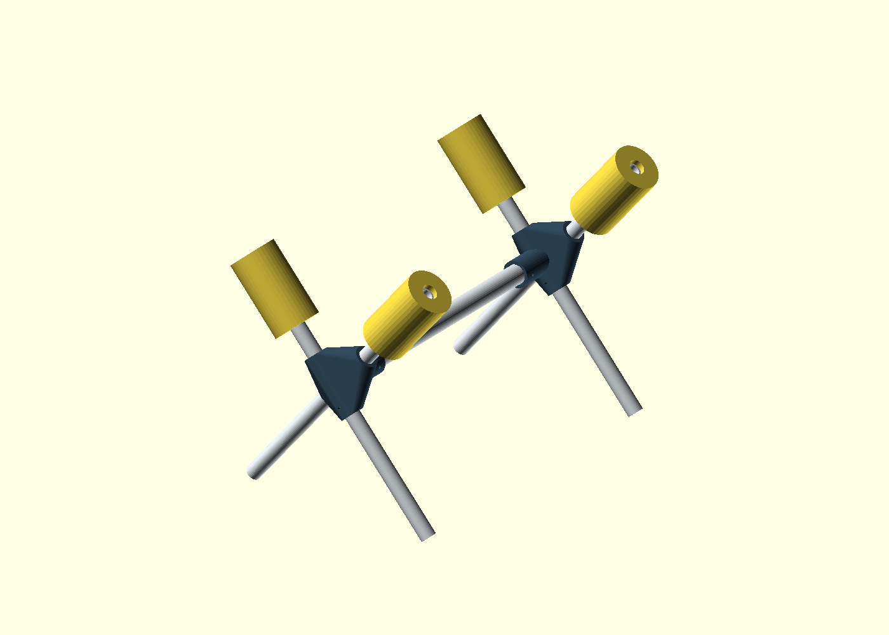

# Fixed-X desktop RC airplane stand

Second concept, retaining the original design in `../desktop-rc-plane-stand/` unchanged. Two identical printed hubs hold four continuous 1/2″ PVC legs in fixed X shapes. A single 3/4″ PVC spine links the hubs. Four pool-noodle sleeves cushion the airplane in upright or inverted positions.



**Two structural prints, five PVC cuts, six retaining bolts.** The stand does not fold; remove the bolts and slide the pipes out to dismantle it. This reduces part count from eight printed connectors in the rectangular design to two larger hubs. It does not establish a lower total print time or plastic consumption.

## How the hub works

The two diagonal pipes pass through separate channels offset 32.14 mm front-to-back. They look like an X from the end but do not physically intersect. There is a 10 mm solid web between their bores. The spine enters a third, blind socket facing toward the other hub; its stop clears both leg channels.

The opposite end uses the same hub rotated 180° about vertical. Each leg has one M4 retaining bolt, and each end of the spine has one. These prevent sliding and rotation. Unbolted round slip fits are not secure connections.

The two pads at each end are slightly staggered lengthwise. Check that both still contact sound fuselage areas. The spine is beneath the aircraft and may limit access below the middle more than the rectangular design does.

## Proposed dimensions — verify against the airplane

| Item | Default |
|---|---:|
| Distance between X crossing centers | 460 mm / 18.1″ |
| Each diagonal pipe | 420 mm / 16.5″ |
| Foot end to crossing along each pipe | 230 mm |
| Crossing to top pipe end | 190 mm |
| Each leg angle from vertical | 40° |
| Included upper V angle | 80° |
| Hub center height above desk, before feet | 183 mm |
| Approximate bare-PVC footprint | 312 × 513 mm / 12.3 × 20.2″ |
| Approximate top of foam above desk | 356 mm / 14.0″ |
| Spine socket insertion depth | 35 mm |

These dimensions are a starting layout, not a measured fit for a Timber X. Fuselage resting height depends on width, contact location and noodle compression. Four equal legs with matching crossing marks put the pipe ends on the same desk plane. Rubber feet change the height slightly.

The shorter upper arms and longer lower legs favor a wider foot stance. `angle`, `leg_length`, `foot_to_crossing` and `station_spacing` are adjustable in OpenSCAD. Reducing the angle narrows both the cradle and the stance. Changing leg or spine diameter also changes the hub and spine cut; use the echoed cut dimensions after edits.

## Parts and cuts

| Part | Quantity | Default cut / specification |
|---|---:|---|
| Printed hub | 2 | Identical |
| 1/2″ PVC continuous diagonal | 4 | 420 mm each |
| 3/4″ PVC spine | 1 | 385.72 mm, approximately 386 mm; fit-trim |
| Pool noodle sleeve | 4 | 110 mm; project 8 mm past pipe tips |
| M4 bolts, washers and locknuts | 6 sets | Two legs and one spine per hub |
| Nonprinted rubber feet/end caps | 4 | Fit actual PVC OD; accommodate angled pipe ends |

About 1.68 m of 1/2″ PVC and 0.386 m of 3/4″ PVC, before saw kerf. The 1/2″ supply is used for all four legs; measure how much stock you have before cutting.

Spine cut = `station_spacing - 2*spine_stop`. Leg channels are through-holes, so there are no leg insertion stops: measure and mark 230 mm from each foot end before drilling the retention holes.

Select bolt lengths after slicing or measuring the hub. Approximately M4 × 85 for the four legs and M4 × 55 for the two spine sockets are conservative starting lengths; trim excess or choose shorter hardware to match measured grip plus washers and nut. Leg bolts pass through the thick hub, not merely a single sleeve. Do not overtighten and crush the pipe.

## Printing and fit

Open `fixed-x-rc-plane-stand.scad` and select:

- `assembly`: full layout, with illustrative PVC and foam; not a printable assembly.
- `hub`: one hub, already rotated with its flat rear face on the bed and spine socket opening upward. Print twice.
- `fit_samples`: two small diameter-check rings, not stand components.

Default pipe outside diameters: 21.34 mm for nominal 1/2″ legs and 26.67 mm for nominal 3/4″ spine, using US IPS PVC. These match the [Charlotte Pipe Schedule 40 table](https://www.charlottepipe.com/uploads/documents/technical/BR-PK.pdf). Measure your stock before printing. `leg_clearance = 0.80` produces 22.14 mm leg bores (0.40 mm clearance per side), adding 0.30 mm of diametral allowance over the previous fit to accommodate roughness left by supports. `spine_clearance = 0.50` produces a 27.17 mm spine socket (0.25 mm per side). These independent settings also apply to their respective fit rings. The added leg clearance is a starting adjustment; test one hub after support removal before printing the second.

Print the fit rings first, then one hub: rings only test diameter, not full channel length or support removal. Starting settings: PETG, 0.20 mm layers, 6 perimeters, 40–50% gyroid infill and 6 top/bottom layers. Use supports in the two horizontal diagonal channels; ensure they can be removed from both open ends. The spine socket is vertical in print orientation. Inspect your slicer's toolpaths before printing. The rear face has a 1 mm flat cut, leaving at least 4 mm nominal wall at the channel's rear surface.

These are untested prototype settings, not a load rating. Two larger prints may use as much material as several small connectors.

## Assembly and check

1. Deburr pipes and test their fit. Mark all four legs 230 mm from their foot ends. Center those marks at the crossing center of each hub.
2. Fit the spine fully into both blind sockets, with the hubs facing inward. Set the assembly on a flat desk; confirm all four feet contact and both X supports are vertical.
3. Fit rubber feet and noodle padding. Noodle bore sizes vary; slit or fit as appropriate, keeping hard pipe tips recessed. Pads must not slide off.
4. While supporting the airplane separately, check contact areas and balance in both orientations. Avoid canopy, fragile foam, controls and gear mounting points. Check propeller, fin and landing-gear clearance. Change dimensions before drilling if needed.
5. Mark and drill PVC through the hub's 4.5 mm bolt holes. Install washers and locknuts on all six bolts. Do not rely on friction to keep the stand aligned.
6. Test progressively with a substitute load and check tipping, pipe flex, hub cracks and joint motion before using with the airplane. No supported-weight limit has been verified.

Lift the airplane out to invert it; the stand is not a rotating fixture. Remove the battery and propeller for gear maintenance. Use only as a static work/display stand, not for motor run-up. The single spine and narrower footprint merit a physical stability check, especially when pressing sideways during repairs.

## Exports and verification

From repository root with OpenSCAD on PATH:

```sh
openscad -o projects/fixed-x-rc-plane-stand/exports/hub.stl -D 'part="hub"' projects/fixed-x-rc-plane-stand/fixed-x-rc-plane-stand.scad
openscad -o projects/fixed-x-rc-plane-stand/exports/fit-samples.stl -D 'part="fit_samples"' projects/fixed-x-rc-plane-stand/fixed-x-rc-plane-stand.scad
```

Generated STLs live in the gitignored `exports/` folder. The CAD includes checks for minimum bore separation, retention-hole clearance, pipe overlap and useful arm lengths. Actual printer fit, aircraft contact geometry and strength require physical testing.

Verification performed for the resized model: OpenSCAD 2026.09.23 rendered the hub and fit-sample STLs successfully with manifold `Status: NoError`. The assembled preview was regenerated and visually inspected. These are CAD checks only; the revised dimensions have not yet been physically printed or load-tested.

Revision 2026-09-26: reduced legs to 1/2″ and spine to 3/4″ nominal PVC, with separate leg/spine clearances. Leg lengths and stand spacing remain unchanged. The narrower hub increases the required spine cut to approximately 386 mm; an old 376 mm spine will not fully seat at the default station spacing. Recheck noodle retention and flex with the smaller legs.
