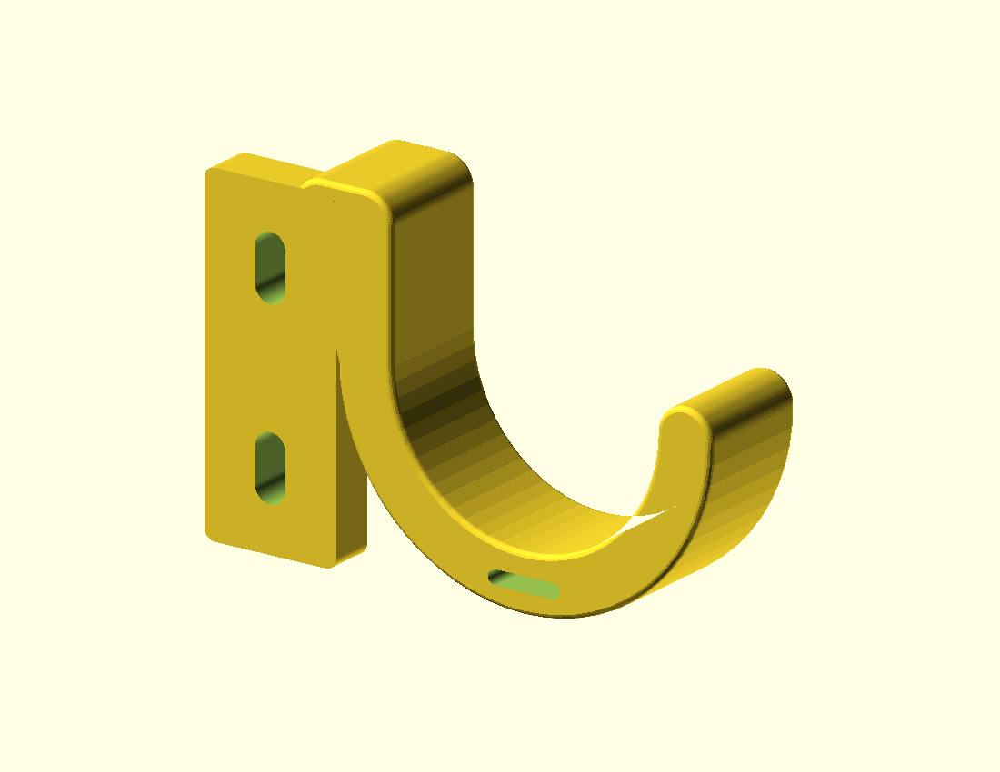

# Rack service-loop saddle

An open J-shaped support beside one rack post for a small bundle of Ethernet,
USB or DC cable slack. The opening lets you lift one cable out without threading
its connector through a closed ring. Two adjustable mounting slots and a loose
hook-and-loop strap retain the part and bundle.

This is the prototype approved from [the design brief](../../docs/proposals/2026-10-04-rack-service-loop-saddle.md).
The default dimensions are examples: **no actual rack or cables were measured**.
It is not a universal 10-inch rack fitting or a load-rated support.

## Sources and outputs

- `rack-service-loop-saddle.scad`: full saddle; choose `side="right"` or `"left"`.
- `mounting-coupon.scad`: the exact same mounting tab and slots, without the hook.
- `part="mounting_coupon"` selects the coupon from the main source too.
- `print_orientation=true` puts the broad side on the bed at Z=0.
  Set it to `false` to inspect the installed position: tab upright, opening up.



The coupon includes the complete mounting tab so you can check both fasteners,
washer edges and screwdriver access together. Change dimensions in the main file;
the coupon includes that file and follows those changes.

## Measure and customize

All dimensions are millimeters. Start with the rail, fasteners and cable bundle:

| Parameter | Example | Meaning |
| --- | ---: | --- |
| `mount_spacing` | 31.75 | Distance between mounting slot centers; measure the chosen rail holes |
| `screw_diameter` | 5.5 | Clearance opening; choose for measured bolts, not an assumed rack thread |
| `slot_travel` | 6 | Extra vertical adjustment, total; example slots are 11.5 mm long |
| `tab_width` / `tab_thickness` | 24 / 8 | Mounting pad width and stand-off from the rail face |
| `mount_edge` | 8 | Material beyond the end of each mounting slot |
| `support_radius` | 24 | Inner arc radius in the profile plane; check the actual cable bend requirement |
| `wall_thickness` | 10 | Arc wall thickness before the strap opening |
| `saddle_width` | 22 | Cable-contact depth, normal to the mounting face |
| `projection` | 68 | Reach beyond the outside edge of the mounting tab |
| `edge_round` | 1 | Rounding on the cable-contact profile and face edges |
| `strap_width` / `strap_clearance` | 12 / 1 | Strap width and added opening clearance |
| `strap_gap` | 2.6 | Thickness opening through the curved base |

The default full envelope in print orientation is approximately 92 × 61.25 × 22 mm;
the coupon is 24 × 59.25 × 8 mm. Rounding facets make the envelope approximate.
Mirror changes the direction of projection, not the rail-facing side or slot spacing.

Check rail profile, occupied holes, thread/cage nuts, bolt length, washer diameter
and tool access. Use washers to spread the load across each slot. Measure the
equipment removal path and available clearance before choosing projection.
The mounting tab has no counterbores or threads; hardware must match the rail.

Measure cable diameters, boots, count, bundle weight and temperature. The inner
arc is open for 180 degrees, with a rounded tip extending half a wall thickness
above the arc center. It is not a closed ring. Round edges do not ensure the whole service loop follows the
specified radius: inspect the installed routing, particularly where cables
enter/leave the contact surface. Use a loose strap rather than compressing jackets.
Feed it through the bottom slot and around the bundle; release it before lifting
a cable out if it crosses the removal path.

Assertions reject dimensions that overlap mounting slots, detach the hook root,
or erase the strap-slot walls. The strap check includes the curved underside and
edge rounding, leaving a conservative 1.5 mm minimum ligament in the profile.
These checks verify geometric relationships, not strength.

## Export

Run from the repository root with OpenSCAD on PATH:

```sh
mkdir -p projects/rack-service-loop-saddle/exports
openscad -o projects/rack-service-loop-saddle/exports/mounting-coupon.stl projects/rack-service-loop-saddle/mounting-coupon.scad
openscad -o projects/rack-service-loop-saddle/exports/right.stl projects/rack-service-loop-saddle/rack-service-loop-saddle.scad
openscad -D 'side="left"' -o projects/rack-service-loop-saddle/exports/left.stl projects/rack-service-loop-saddle/rack-service-loop-saddle.scad
```

On this Mac the executable is
`/Applications/OpenSCAD-2021.01.app/Contents/MacOS/OpenSCAD`.
Exports are ignored by Git and can be regenerated. Edge rounding uses a small
Minkowski operation, so a full STL takes longer than the mounting coupon.

## First print and physical checks

Start with the coupon in PETG. An initial slicer setup is 0.2 mm layers, four
perimeters and 30–40% infill. Use the supplied broad-side-down orientation, which
puts the J profile and root in the layer plane. The tab ends at 8 mm and the hook
extends to 22 mm; inspect those transitions and small rounded edges in your
slicer. No support is intended under the main arc in this orientation, but support
requirements have not been checked in a slicer. Avoid cable-contact support scars.

Fit the coupon without force, check washers/bolts and tool access, then print
one saddle. Check cable/boot clearance, bend radius and one-cable removal while
neighboring leads stay connected. Verify the device can still slide out. Repeat
removal/replacement, inspect jackets, fastener loosening and the thin walls around
the strap slot. Check creep with the actual bundle over a recorded time and rack
temperature. These print settings and material are starting points, not validated
strength or durability evidence.

CAD acceptance covers closed connected meshes for the default saddle, mirror,
coupon and a customized example, plus intended parameter assertion failures.
Physical fit, load capacity, retention, useful servicing and thermal durability
remain unverified.
