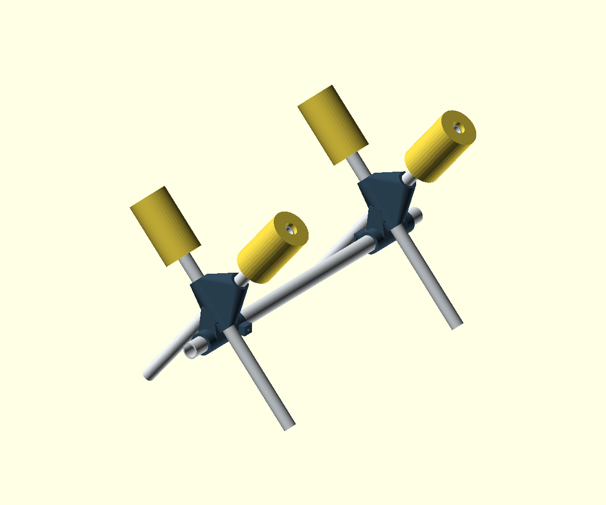
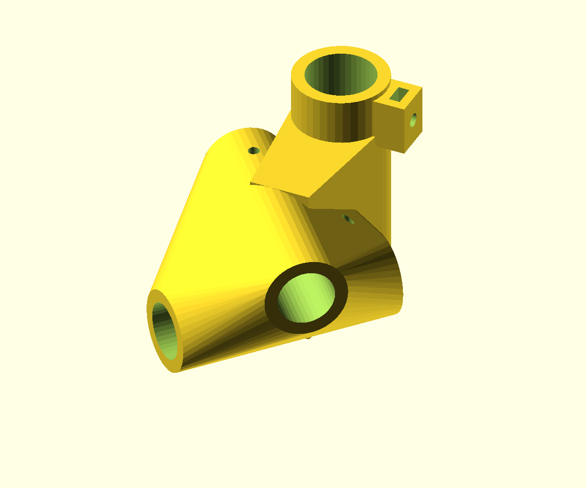
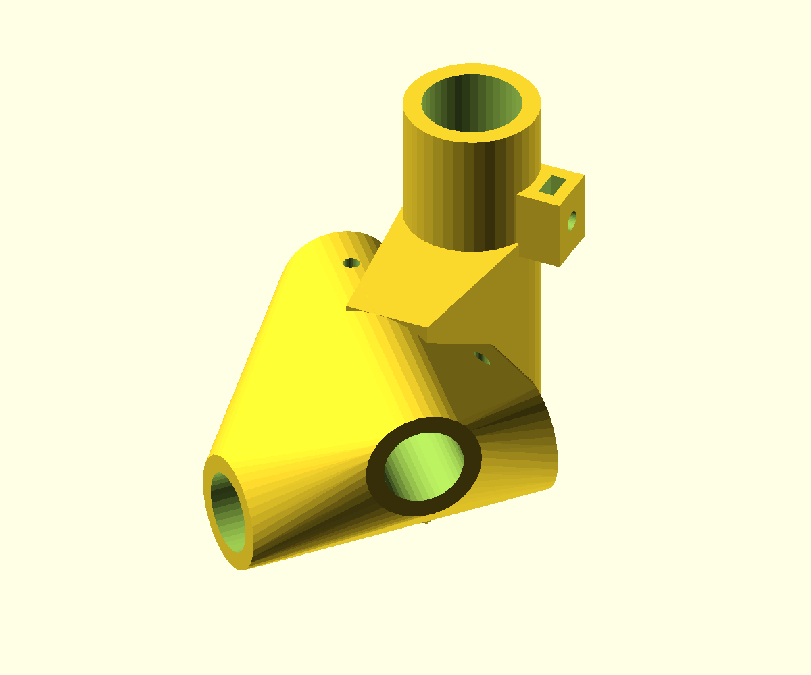

# Sliding fixed-X RC stand

Additional version of the fixed-X stand. The original files and the hubs already being printed are unchanged. Print two identical sliding hubs and reuse the same four 420 mm lengths of 1/2″ PVC, with the crossing marked 230 mm from each foot. The 80° V, leg spacing, cradle height and 22.14 mm leg bores are retained.



## Why the center tube moved

Simply extending the original socket through the original hub would intersect both continuous diagonal legs. This version lowers the 3/4″ tube center by 58 mm, leaving approximately 12.6 mm minimum clearance between the spine bore and either leg bore. A printed bridge joins the sleeve to the X body. The resulting hub is taller and has a 100 mm long sleeve; it is not the same external envelope as the original.

Use **two sliding hubs together**. A sliding hub and an original fixed hub have different spine heights and cannot be mixed on one straight horizontal connecting tube. Existing leg pipes can be reused, but check the retention holes before reusing already-drilled legs.

## Adjustment and locking

The 27.17 mm bore passes all the way through. Slide either end support along a straight, undrilled 3/4″ PVC tube, then hand-tighten its M5 nylon-tipped thumbscrew against the pipe. A standard M5 hex nut slides into the side slot in the printed boss; the pocket captures the nut axially and restrains rotation. Keep the nut in place while initially threading the screw. Hardware is not shown in the preview.

Starting hardware per hub: one standard M5 nut (8 mm across flats, about 4 mm thick), one M5 × 20 nylon-tipped thumbscrew, and the same two M4 leg-retaining bolts with washers and locknuts. Verify your nut fits the 8.5 mm-wide, 4.4 mm-thick pocket. Screw length refers to usable length under the head; confirm your chosen screw reaches the pipe before its shoulder bottoms. Tighten only enough to hold position without denting the PVC. No hole is drilled in the connecting pipe.

Default tube cut: **620 mm**. The preview places the X centers 460 mm apart, leaving 30 mm of pipe beyond each 100 mm sleeve. For full engagement and 10 mm beyond each sleeve, maximum centered station spacing is 500 mm with this cut. Shorter spacings are possible, but the actual aircraft contact points and balance set the useful range. Keep both sleeves fully engaged and the airplane's center of gravity inside the footprint. Unload the stand before adjusting. Test sliding and twisting resistance with a substitute load before placing the airplane on it; this friction lock is not load-rated.

## OpenSCAD and printing

`sliding-x-rc-plane-stand.scad` selectors:

- `assembly`: complete preview.
- `hub`: printable hub, spine axis vertical, one sleeve end on the bed. Print two.
- `fit_samples`: one ring for each pipe size.

Leg OD: 21.34 mm, plus 0.80 mm diametral clearance. Spine OD: 26.67 mm, plus 0.50 mm diametral clearance. These carry forward the nominal US IPS pipe dimensions from the fixed-X design; measure your stock. Set `station_spacing` for the preview and `spine_length` for your tube cut. Leg geometry and fit settings remain adjustable at the top of the source.

Starting settings: PETG, 0.20 mm layers, 6 walls, 40–50% gyroid infill, 6 top/bottom layers, brim. **Support the raised X body, horizontal leg bores and locking boss** in the supplied print orientation. The spine bore is vertical and should not need internal support. Inspect the slicer before printing, remove supports and test one full hub before printing the second. Small vertical fit rings do not reproduce roughness in supported channels.



Four 110 mm pool-noodle sleeves and rubber feet are used as in the fixed version. Check upright and inverted clearances against the real airplane. Remove battery and propeller for maintenance. Static work/display use only.

## Export

Run from the repository root with OpenSCAD on PATH:

```sh
openscad -o projects/sliding-x-rc-plane-stand/exports/hub.stl -D 'part="hub"' projects/sliding-x-rc-plane-stand/sliding-x-rc-plane-stand.scad
openscad -o projects/sliding-x-rc-plane-stand/exports/fit-samples.stl -D 'part="fit_samples"' projects/sliding-x-rc-plane-stand/sliding-x-rc-plane-stand.scad
openscad -o projects/sliding-x-rc-plane-stand/exports/flush-sleeve-hub.stl projects/sliding-x-rc-plane-stand/flush-sleeve-hub.scad
```

Generated exports are gitignored. CAD checks do not establish print strength, aircraft fit or clamp holding force; physical testing is still required.

Verification: OpenSCAD 2021.01 exported the hub with `Simple: yes` and one solid plus the exterior volume. Assembly and print-orientation previews were rendered and visually inspected. The model asserts bore separation and full spine engagement for the chosen preview spacing. No physical print or locking-force test has been performed.

## Flush-sleeve alternative (requested revision)

`flush-sleeve-hub.scad` and `exports/flush-sleeve-hub.stl` retain the original curved X body and round leg bores. Only the 100 mm connecting-tube sleeve and its through-bore are shifted 17.86 mm along the connecting tube, bringing the sleeve's lower end flush with the X body's lowest surface in the supplied print orientation. The printed part is repositioned onto the bed accordingly. This does not change the connecting tube's height in the assembled stand, leg positions, fit clearances or locking hardware.



This is the smaller change requested instead of the broad-backed low-support variant. It removes the initial gap under the X body, but the curved underside, round leg-bore ceilings and screw boss may still need support. Check your slicer preview. Default tube length and 460 mm station spacing still provide full sleeve engagement. CAD export and physical print verification are separate; the new support requirement has not been measured in a slicer.

## Validation on 2026-10-02

Both hub STLs exported with OpenSCAD 2021.01 as `Simple: yes`, one solid plus exterior volume. Each mesh has closed two-face edges and consistent winding; fit samples export as two closed rings. Naming the bridge, boss and nut-slot dimensions at the top preserved the default exported geometry.

Both assembly selectors accept 500 mm station spacing with the default tube cut. The centered variant rejects 501 mm spacing; the flush variant rejects a 20 mm spine drop that would intersect the leg bores. An unknown part selector is rejected. These are CAD checks. Slicer support requirements, full-hub pipe and hardware fit, clamp holding force, aircraft clearance and stability remain unverified.
