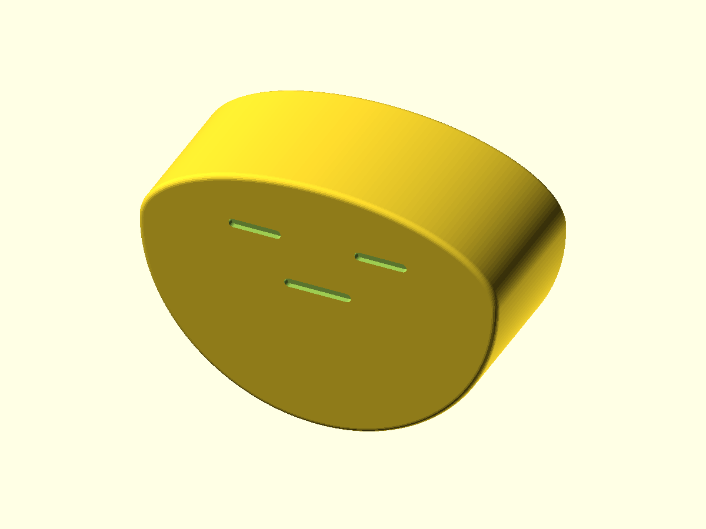

# Wobble potato

A squat, unimpressed potato that aims to rock in one plane after a gentle nudge. One rigid print, no ballast or moving joints. Default dimensions are approximately 52 × 38 × 22 mm. These are prototype assumptions, not a measured fit or proven balance recipe.



## Source and exports

`wobble-potato.scad` has a circular lower belly and a short half-elliptical cap. The cap width follows the belly diameter so their join stays tangent. Shallow recessed strokes form the eyes and mouth. Millimeter parameters are at the top.

| Parameter | Default | Purpose |
| --- | --- | --- |
| `belly_radius` | 26 | Circular contact radius and half-width |
| `cap_height` | 12 | Height above the arc center, less than the belly radius |
| `body_width` | 22 | Width perpendicular to rocking |
| `edge_round` | 0.8 | Approximate broad-face edge fillet; zero leaves square edges |
| `face_depth` | 0.8 | Shallow recess depth; at least 2 mm of central core remains |
| `face` | `"both"` | Both faces, top face only with `"front"`, or `"none"` |
| `orientation` | `"print"` | Broad face on bed; `"upright"` is a desk-view export |
| `contact_segments` | 192 | Profile resolution; integer ≥48, divisible by four |

Face sizes and positions derive from the body dimensions. The fillet uses six quarter-circle sections; the central contact band retains the circular belly profile. Assertions check dimensions and selectors. They do not certify balance or printability on every printer.

From the repository root, with `openscad` on PATH:

```sh
mkdir -p projects/wobble-potato/exports
openscad -o projects/wobble-potato/exports/wobble-potato.stl projects/wobble-potato/wobble-potato.scad
openscad -D 'face="none"' -o projects/wobble-potato/exports/balance-prototype.stl projects/wobble-potato/wobble-potato.scad
openscad -D 'face="front"' -o projects/wobble-potato/exports/front-face-potato.stl projects/wobble-potato/wobble-potato.scad
```

On this Mac, the executable is `/Applications/OpenSCAD-2021.01.app/Contents/MacOS/OpenSCAD` if no shell alias exists. Exports are ignored by Git; regenerate them from source. The upright export is for viewing, not the recommended print orientation.

## First print

Start with one complete `face="none"` balance prototype. PLA is a candidate for a cool indoor desk. Use 0.2 mm layers, four walls, and 100% infill as an initial attempt to approximate uniform mass. This is a proposed print recipe; inspect and record the actual toolpath and mass. Keep that recipe fixed when comparing the decorated print. No purchased hardware is needed and no mating fit tolerance applies.

Lay a broad face on the bed, as the default export supplies it. Start with supports off after checking the toolpath. Both-face decoration has tiny recesses against the bed that bridge after the recess depth; verify those bridges or use `face="front"` to leave the bed face flat. Check elephant foot, adhesion, contact-band faceting and surface roughness. Keep seam placement off the center of the belly contact band when the slicer allows it. A rough contact band may stick or mark the desk.

The ideal uniform, unrounded profile has its centroid about 5.94 mm below the contact-arc center at the defaults. OpenSCAD echoes this estimate. Rounding, facial recesses, shells and infill alter the actual mass distribution; the estimate only screens the starting geometry. A complete mesh mass calculation is also a uniform-solid model, not evidence about the sliced print. No recovery from arbitrary orientations is promised.

## Physical checks

Confirm the desired size, expression and one-plane motion. Record desk surface and slope, available space, printer/nozzle/material, layer/wall/infill settings and temperature. The 52 mm body width in the rocking plane needs room to move away from desk edges. Before printing, choose a modest release angle, acceptable final resting tilt and permitted drift. A starting trial could use a 10° release and a ±3° resting tolerance; these are proposed test settings, not achieved results.

1. Inspect the toolpath, print one full undecorated body, then measure its dimensions and mass. A thin arc coupon cannot validate full-body balance or sideways tipping.
2. On a level surface, release it ten times from each side at the chosen angle. Require all ten per side to return within the chosen resting tolerance without falling onto a broad face. Record sticking, sliding and travel distance. Revise or stop if it fails.
3. Print the decorated version with the same recipe and repeat the tests. A gentle nudge should give visible rocking without needing a launch. A front-only face is asymmetric; test it separately.
4. Repeat fifty gentle nudges, inspect the contact band for wear, roughness or desk marks, and recheck motion at the recorded temperature.
5. Try a short play session. Keep the design only if the motion and expression are enjoyable.

Mesh/export checks establish geometric validity. Printed balance, acceptable recovery angle, desk wear and enjoyment remain unverified. There is no therapeutic or productivity claim. Earlier card-perch and seed-chute proposals are independent and remain unimplemented.
